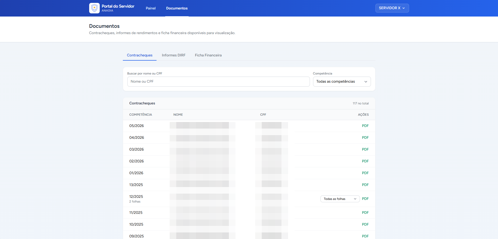
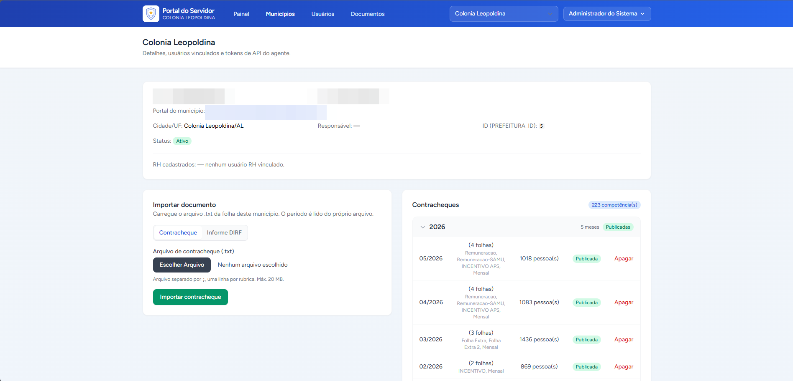
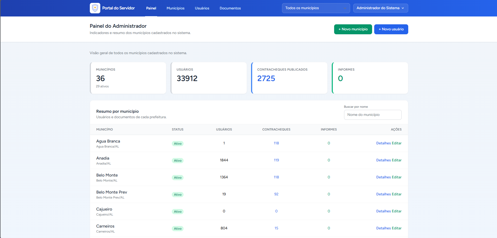
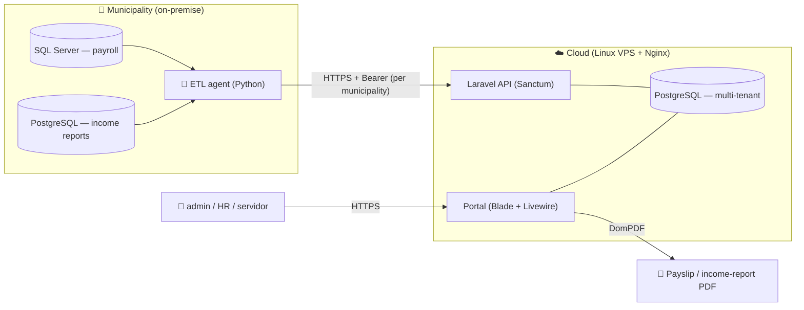

<div align="center">

# 🏛️ Multi-tenant Payslip & Income-Report Portal

**SaaS for municipalities** · Laravel API + portal · Python ETL agent · Multi-tenant PostgreSQL · In production


A multi-tenant SaaS that delivers **payslips** and **annual income reports (DIRF)** to public servants
across many municipalities. A custom **Python ETL agent** extracts data at the source and ships it to the
portal API — so the payroll database is **never exposed to the internet**.

</div>

> **Note on source code.** This repository is a **public showcase** of a commercial product.
> The full source is private; this README documents the architecture and engineering decisions.
> No real data (names / tax IDs) is included here. Code walkthrough available on request.

---

## 📸 Screenshots

| Employee portal | Municipality management | Admin overview (multi-tenant) |
|---|---|---|
|  |  |  |

---

## ✨ Features

- 🏢 **Multi-tenant by design** — one platform, many municipalities, fully isolated from each other.
- 👥 **Three roles (RBAC)** — `admin` (manages all municipalities & API tokens), `hr` (own municipality only),
  `servidor` (own login; views and prints only their published documents).
- 🔌 **Custom ETL agent** — runs on the municipality's machine, reads local sources and pushes data over HTTPS.
- 🧾 **Server-side document rendering** — payslips and income reports generated as PDF (DomPDF).
- 🔐 **Per-municipality API tokens** (Laravel Sanctum) for the ingestion API.
- 🚀 **Automated deploy** — push to `main` → CI runs → VPS pulls, migrates and rebuilds assets.
- 🧪 **Tested on two databases** — the suite runs against SQLite *and* PostgreSQL in CI.

---

## 🏗️ Architecture

The payroll database stays on the municipality's network. The **agent** is the only thing that talks out,
pushing data to the cloud API over an authenticated HTTPS channel.



---

## 🔑 Multi-tenancy — the core design decision

Every tenant's data lives in **one PostgreSQL database**, isolated at the row level by a `prefeitura_id`
(municipality id) column present in every table. Isolation is enforced automatically by **Eloquent global scopes**:

- `TenantScope` — every query is automatically filtered to the current municipality.
- `ServidorCpfScope` — a `servidor` only ever sees rows matching their own CPF (tax id).

Because the scopes are global, **no developer can accidentally write a query that leaks data across
municipalities** — the isolation is the default, not something you remember to add.

---

## 🧰 Tech stack

| Layer | Technology |
|---|---|
| **Web portal & API** | Laravel 13 · Blade · Livewire · Tailwind CSS |
| **Auth** | Laravel Sanctum (per-municipality API tokens) · role-based access |
| **PDF** | DomPDF (server-side rendering) |
| **ETL agent** | Python (CLI: `ping`, `contracheque`, `informe`) |
| **Database** | PostgreSQL (production, multi-tenant) · SQLite (local/tests) |
| **Sources** | SQL Server (payroll) · PostgreSQL (income reports) |
| **CI/CD** | GitHub Actions (SQLite + PostgreSQL matrix) · VPS + Nginx deploy |
| **Tests** | Pest |

---

## 🔒 Engineering highlights

The decisions that make this production-grade and safe to operate across many clients:

- **Schema changes are always migrations.** Nothing is changed by hand on the production database.
  Every change ships as a Laravel migration that the deploy applies with `migrate --force`.
- **Migrations run on two databases.** They must work on both SQLite (tests) and PostgreSQL (production).
  PostgreSQL-specific SQL (partial indexes, JSONB) is guarded with `if (DB::getDriverName() === 'pgsql')`
  and given an equivalent path for SQLite, so the test suite never diverges from production.
- **CI mirrors the real deploy.** GitHub Actions runs the full suite on a **SQLite + PostgreSQL matrix**,
  plus a sanity job that dry-runs the deploy on a clean Postgres (migrate → seed → cache) before anything
  reaches `main`. The deploy only executes on `main` and only if everything passes.
- **PII never leaks into the repo.** Real names, tax IDs, payslip `.txt` and income-report XML are all
  git-ignored; the showcase and tests use synthetic data only.
- **The payroll DB is never exposed.** Only the outbound agent talks to the cloud — the source databases
  stay inside the municipality's network.
- **Re-skinnable per client.** Brand color is centralized in `tailwind.config.js`; municipality logos live
  on disk with the DB storing only a path — web uses a public URL, PDF embeds a data URI.

---

## 🧪 Testing

```bash
cd portal
composer test          # full Pest suite (recommended before each commit)
php artisan test       # equivalent
```

New routes/features ship with a matching Pest test. CI runs the same suite on SQLite and PostgreSQL.

---

## 👤 Author

**Carlos Alberto C. de Azevedo Filho** — Software Developer
🌐 [patoxzor.github.io](https://patoxzor.github.io) · 💼 [LinkedIn](https://www.linkedin.com/in/azevedoocarlos/) · 🐙 [GitHub](https://github.com/Patoxzor)
